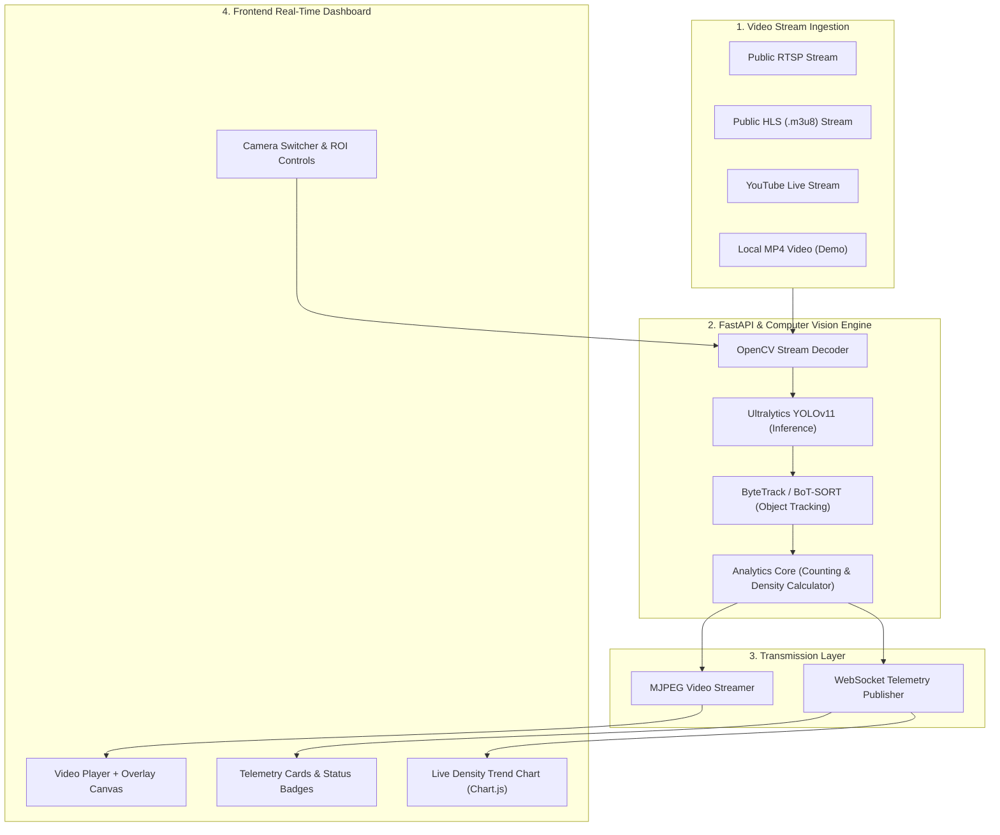

# Product Requirements Document (PRD)
## Smart City Real-Time Vehicle Detection & Traffic Analytics System

---

## 1. Document Overview
- **Project Name:** Deteksi-Kendaraan (Real-Time Smart CCTV Vehicle Detection & Traffic Dashboard)
- **Version:** 1.0.0
- **Status:** Draft / Approved for MVP Development
- **Tech Stack:** Python (FastAPI, OpenCV, Ultralytics YOLOv11, ByteTrack) + Frontend Web (Vite/React, WebSockets, Chart.js, HTML5 Canvas)

---

## 2. Executive Summary & Goals

### 2.1 Executive Summary
Sistem **Deteksi-Kendaraan** adalah aplikasi pemantauan lalu lintas cerdas (*Intelligent Transportation System*) berbasis *Computer Vision* terkini (**YOLOv11**). Sistem ini mengambil *video stream* dari CCTV publik (format RTSP, HLS `.m3u8`, YouTube Live, atau Video File), memproses deteksi dan *tracking* kendaraan secara *real-time*, lalu menyajikan analisis lalu lintas pada *Dashboard Web* yang modern, interaktif, dan responsif.

### 2.2 Project Goals
1. **Automated Traffic Ingestion:** Mampu memproses *live video feed* dari CCTV publik tanpa *delay* tinggi.
2. **Precision Detection & Classification:** Mendeteksi 4 kategori kendaraan utama: **Mobil (Car)**, **Sepeda Motor (Motorcycle)**, **Bus**, dan **Truk (Truck)**.
3. **Real-time Analytics:** Menghitung jumlah kendaraan per kategori, mengukur kerapatan lalu lintas (*Traffic Density Status: Lancar, Sedang, Macet*), serta menghitung kendaraan yang melewati *Virtual Line* (ROI Crossing).
4. **Interactive Dashboard:** Menyediakan antarmuka pemantauan *real-time* berbasis *Dark Glassmorphism UI* lengkap dengan grafik tren dan indikator FPS.

---

## 3. Core Target Audience & Use Cases

| User Persona | Main Goal / Use Case |
| :--- | :--- |
| **Operator Lalu Lintas (Dishub/ATCS)** | Memantau kepadatan jalan secara *real-time*, mendeteksi kemacetan mendadak, serta melihat rekaman *snapshot*. |
| **Perencana Kota (City Planner)** | Menganalisis volume dan komposisi kendaraan (proporsi motor vs mobil vs truk) pada jam-jam sibuk. |
| **Masyarakat Umum / Pengguna Jalan** | Melihat status kepadatan jalan secara langsung melalui CCTV publik sebelum melintas. |

---

## 4. System Architecture & Data Flow

---

## 5. Functional Requirements (FR)

### FR-1: Stream Ingestion & Management
- **FR-1.1:** Sistem mendukung ingestion video dari URL RTSP, URL HTTP/HLS (`.m3u8`), dan file video lokal (MP4/AVI) sebagai fallback testing.
- **FR-1.2:** Pengguna dapat berpindah antar kamera CCTV (Multi-CCTV Stream Selector).
- **FR-1.3:** Fitur *Auto-Reconnect* apabila koneksi stream CCTV terputus secara mendadak.

### FR-2: AI Detection & Tracking Engine (YOLOv11)
- **FR-2.1:** Sistem menggunakan model **YOLOv11** (`yolo11n.pt` / `yolo11s.pt`) untuk melakukan deteksi objek.
- **FR-2.2:** Filter kelas kendaraan terbatas pada COCO classes:
  - Class 2: `car` (Mobil)
  - Class 3: `motorcycle` (Sepeda Motor)
  - Class 5: `bus` (Bus)
  - Class 7: `truck` (Truk)
- **FR-2.3:** Setiap kendaraan yang terdeteksi diberikan *Bounding Box*, label kelas, nilai *confidence score*, dan *Unique Tracking ID* menggunakan ByteTrack.

### FR-3: Traffic Analytics & ROI Crossing
- **FR-3.1:** **Vehicle Counter:** Menghitung statistik jumlah kendaraan aktif dalam frame per kategori secara *real-time*.
- **FR-3.2:** **Traffic Density Status:** Mengkalkulasi tingkat kemacetan berdasarkan jumlah total kendaraan dalam frame:
  - **Lancar:** < 8 kendaraan
  - **Sedang:** 8 - 18 kendaraan
  - **Macet:** > 18 kendaraan
- **FR-3.3:** **Virtual Counting Line (ROI):** Garis imajiner yang menghitung kendaraan saat melintasi garis (misal: arah masuk vs arah keluar).

### FR-4: Dashboard & Interactive Controls
- **FR-4.1:** **Live Player Feed:** Menampilkan video hasil deteksi secara *real-time* (MJPEG / WebRTC stream).
- **FR-4.2:** **Telemetry Widget:** Menampilkan total kendaraan, breakdown per kelas, FPS pemrosesan backend, dan Latency.
- **FR-4.3:** **Traffic Density Chart:** Grafik garis *real-time* (update per detik/menit) yang merekam tren jumlah kendaraan.
- **FR-4.4:** **Snapshot Tool:** Tombol untuk mengambil tangkapan layar frame deteksi saat ini dan menyimpannya sebagai gambar.

---

## 6. Non-Functional Requirements (NFR)

- **NFR-1: Performance & Latency**
  - Latency pemrosesan backend ke frontend < 300ms.
  - FPS pemrosesan minimal 15-30 FPS pada perangkat CPU standar / GPU entry-level.
- **NFR-2: Usability & Aesthetic**
  - Menggunakan tema **Sleek Dark Glassmorphic Dashboard** sesuai standar *UI/UX Pro Max*.
  - Bebas *Cumulative Layout Shift (CLS)* dan responsif untuk layar desktop (1080p, 2K, 4K) dan tablet.
- **NFR-3: Reliability**
  - Server tidak crash jika stream CCTV offline (menampilkan placeholder "Stream Unavailable").
- **NFR-4: Scalability**
  - Modul deteksi terpisah dari modul web server (decoupled architecture).

---

## 7. Tech Stack Overview

| Layer | Technology Selected | Rationale |
| :--- | :--- | :--- |
| **AI Model** | Ultralytics YOLOv11 (`yolo11n`) | Arsitektur YOLO terbaru, kecepatan tinggi (low-latency inference), dan sangat efisien di CPU/GPU. |
| **Backend API** | Python 3.10+, FastAPI, Uvicorn | Framework async tercepat di Python, dukungan native WebSockets. |
| **Computer Vision** | OpenCV (`opencv-python`) | Pengolahan image/video frame, penarikan RTSP/HLS stream, drawing overlay. |
| **Realtime Protocol** | WebSockets + MJPEG Streaming | Transmisi telemetry data (JSON) & video frame secara simultan tanpa overhead tinggi. |
| **Frontend UI** | HTML5, Modern Vanilla JS / React + Vite | Performa rendering cepat, ringan, manipulasi Canvas efisien. |
| **Styling** | Vanilla CSS Grid & Glassmorphism | Kontrol visual 100%, tampilan premium & futuristic. |
| **Charts & Data** | Chart.js / Recharts | Grafik visualisasi data real-time yang responsif & ringan. |

---

## 8. Success Criteria for MVP

- [x] Stream CCTV publik / video lokal dapat diputar & dideteksi tanpa error.
- [x] Bounding box YOLOv11 + Tracking ID muncul secara presisi di video feed.
- [x] Data penghitung kendaraan & status kepadatan ter-update di dashboard via WebSocket secara real-time.
- [x] Tampilan Dashboard memenuhi standar visual *UI/UX Pro Max*.
