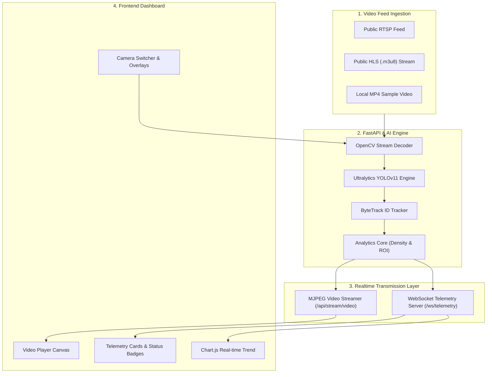

# 🚗 Smart City Real-Time Vehicle Detection & Traffic Analytics System

[](https://www.python.org/)
[](https://fastapi.tiangolo.com/)
[](https://docs.ultralytics.com/)
[](https://vitejs.dev/)
[](LICENSE)

A state-of-the-art **Intelligent Transportation System (ITS)** built with **YOLOv11**, **ByteTrack**, **FastAPI**, and a **Futuristic Dark Glassmorphism Web Dashboard**. The application processes public CCTV video feeds (RTSP/HLS streams or local MP4 files) in real-time, performing automated vehicle classification, object tracking, traffic density estimation, ROI line-crossing counting, and live telemetry streaming over WebSockets.

---

## 🌟 Key Features

- **🤖 YOLOv11 Object Detection & Tracking:** Real-time detection and persistent tracking (ByteTrack) for 4 primary vehicle categories:
  - 🚗 **Mobil (Car)**
  - 🏍️ **Sepeda Motor (Motorcycle)**
  - 🚌 **Bus**
  - 🚚 **Truk (Truck)**
- **📊 Real-Time Traffic Analytics:**
  - **Active Vehicle Count:** Live breakdown per vehicle class in frame.
  - **Traffic Density Classifier:** Calculates congestion level (**LANCAR** < 8, **SEDANG** 8-18, **MACET** > 18) with dynamic glowing status badges and gauge meters.
  - **Virtual ROI Line Crossing:** Tracks and counts vehicles crossing a defined ROI line.
- **📺 Multicast Decoupled Streaming:** Decoupled background inference thread running at ~30 FPS; supports multiple concurrent dashboard clients without redundant model compute.
- **🎛️ Interactive Dashboard:**
  - Glassmorphism dark mode command center design adhering to **StyleGuide.md**.
  - MJPEG video feed player with toggleable YOLO Bounding Boxes and ROI Counting Lines.
  - Real-time smooth trend line chart powered by **Chart.js**.
  - Multi-CCTV camera switcher preset selector.
  - Snapshot download feature for saving annotated CCTV images.

---

## 🏗️ System Architecture



---

## 🚀 Quick Start Guide

### Prerequisites

- **Python 3.10+**
- **Node.js 18+** & **npm**
- **FFmpeg** (Recommended for OpenCV HLS stream playback)

---

### 1. Backend Setup (FastAPI & YOLOv11)

1. Navigate to the backend directory:
   ```bash
   cd backend
   ```

2. (Optional) Create and activate a Python virtual environment:
   ```bash
   python -m venv venv
   # On Windows:
   venv\Scripts\activate
   # On macOS/Linux:
   source venv/bin/activate
   ```

3. Install required dependencies:
   ```bash
   pip install -r requirements.txt
   ```

4. Start the FastAPI server:
   ```bash
   python -m uvicorn app.main:app --host 0.0.0.0 --port 8000 --reload
   ```

   - Server API Docs: `http://localhost:8000/docs`
   - MJPEG Stream: `http://localhost:8000/api/stream/video`
   - WebSocket Telemetry: `ws://localhost:8000/ws/telemetry`

---

### 2. Frontend Setup (Dashboard Web UI)

1. Navigate to the frontend directory:
   ```bash
   cd frontend
   ```

2. Install npm packages:
   ```bash
   npm install
   ```

3. Start the Vite development server:
   ```bash
   npm run dev
   ```

4. Open your browser and navigate to:
   ```
   http://localhost:3000
   ```

---

## 📡 API Endpoints

| Method | Endpoint | Description |
| :--- | :--- | :--- |
| `GET` | `/api/health` | Backend status, active camera, model version, and live FPS. |
| `GET` | `/api/cameras` | List of available CCTV stream presets. |
| `POST` | `/api/stream/select` | Switch active camera source (`{ "camera_id": "cam-01" }`). |
| `POST` | `/api/stream/toggle` | Toggle Bounding Boxes / ROI line overlays. |
| `GET` | `/api/stream/video` | MJPEG real-time video stream. |
| `WS` | `/ws/telemetry` | WebSocket endpoint broadcasting JSON telemetry data at 5Hz. |
| `GET` | `/api/snapshot` | Download high-quality JPEG snapshot of the current frame. |

---

## 📁 Repository Structure

```
Deteksi-Kendaraan/
├── backend/
│   ├── app/
│   │   ├── __init__.py
│   │   ├── analytics.py        # Vehicle counting, density status & ROI logic
│   │   ├── config.py           # Presets, vehicle class maps & ROI coordinates
│   │   ├── detector.py         # YOLOv11 & ByteTrack integration
│   │   ├── main.py             # FastAPI REST endpoints & WebSocket server
│   │   └── stream_handler.py   # OpenCV video stream ingestion & auto-reconnect
│   ├── assets/
│   │   └── sample_cctv.mp4     # Local offline fallback video
│   ├── requirements.txt
│   └── yolo11n.pt              # Ultralytics YOLOv11 nano model weights
├── frontend/
│   ├── index.html              # Bento grid UI layout
│   ├── package.json
│   └── src/
│       ├── main.js             # WebSocket connection, Chart.js & UI handlers
│       └── styles/
│           └── index.css       # Dark glassmorphism styling & animations
├── PRD.md                      # Product Requirements Document
├── StyleGuide.md               # UI/UX design specifications
└── Tasks.md                    # MVP Roadmap & Execution tasks
```

---

## 📄 License

Distributed under the MIT License. See `LICENSE` for more information.
