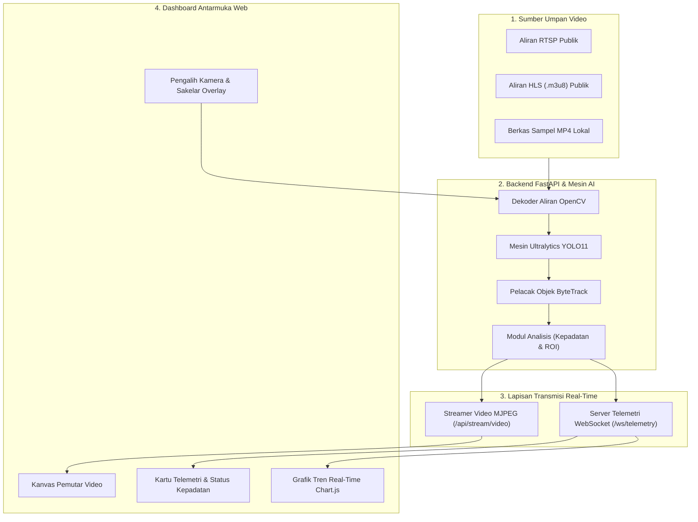

# Sistem Deteksi Kendaraan dan Analisis Lalu Lintas Real-Time (YOLO11 & FastAPI)

[](https://www.python.org/)
[](https://fastapi.tiangolo.com/)
[](https://docs.ultralytics.com/)
[](https://vitejs.dev/)
[](LICENSE)

Sistem Transportasi Cerdas (Intelligent Transportation System / ITS) berbasis **YOLO11**, **ByteTrack**, **FastAPI**, dan **Dashboard Web Interaktif**. Aplikasi ini memproses aliran video CCTV publik (protokol RTSP/HLS atau berkas video MP4 lokal) secara langsung (real-time) untuk klasifikasi kendaraan, pelacakan pergerakan, estimasi tingkat kepadatan lalu lintas, penghitungan kendaraan berbasis garis batas ROI (line-crossing), serta streaming telemetri melalui WebSocket.

---

## Fitur Utama

- **Deteksi dan Pelacakan Objek (YOLO11 & ByteTrack)**: Deteksi langsung dan pelacakan presisi (ByteTrack) untuk 4 kategori kendaraan utama:
  - Mobil (Car)
  - Sepeda Motor (Motorcycle)
  - Bus
  - Truk (Truck)
- **Analisis Lalu Lintas Real-Time**:
  - **Penghitungan Kendaraan Aktif**: Rincian jumlah kendaraan per kelas yang berada di dalam frame secara langsung.
  - **Klasifikasi Kepadatan Lalu Lintas**: Menghitung tingkat kepadatan lalu lintas (LANCAR < 8, SEDANG 8-18, MACET > 18).
  - **Penghitungan Garis Batas Virtual (ROI Line Crossing)**: Melacak dan menghitung akumulasi kendaraan yang melintasi garis pemantauan yang ditentukan.
- **Streaming Multicast Terpisah (Decoupled)**: Thread inferensi latar belakang berjalan pada ~30 FPS; mendukung banyak klien dashboard secara bersamaan tanpa redundansi komputasi model AI.
- **Dashboard Web Interaktif**:
  - Tampilan antarmuka pusat kendali berbasis *Dark Glassmorphism*.
  - Pemutar video stream MJPEG dengan opsi sakelar tampilan bounding box dan garis batas ROI.
  - Grafik tren volume lalu lintas real-time menggunakan Chart.js.
  - Menu pemilih sumber kamera CCTV (preset switcher).
  - Fitur unduh tangkapan layar (snapshot) beranotasi kualitas tinggi.

---

## Arsitektur Sistem



---

## Prasyarat Sistem

- **Python 3.10+**
- **Node.js 18+** & **npm**
- **FFmpeg** (Disarankan untuk pemutaran aliran HLS pada OpenCV)

---

## Panduan Instalasi dan Penggunaan

### 1. Konfigurasi Backend (FastAPI & YOLO11)

1. Masuk ke direktori backend:
   ```bash
   cd backend
   ```

2. Buat dan aktifkan virtual environment (opsional tetapi disarankan):
   ```bash
   python -m venv venv
   # Windows:
   venv\Scriptsctivate
   # Linux/macOS:
   source venv/bin/activate
   ```

3. Pasang paket dependensi yang diperlukan:
   ```bash
   pip install -r requirements.txt
   ```

4. Jalankan server FastAPI:
   ```bash
   python -m uvicorn app.main:app --host 0.0.0.0 --port 8000 --reload
   ```

   - Dokumentasi Interaktif Swagger UI: `http://localhost:8000/docs`
   - Aliran Video MJPEG: `http://localhost:8000/api/stream/video`
   - Endpoint WebSocket Telemetri: `ws://localhost:8000/ws/telemetry`

---

### 2. Konfigurasi Frontend (Dashboard Web)

1. Buka terminal baru dan masuk ke direktori frontend:
   ```bash
   cd frontend
   ```

2. Pasang paket npm:
   ```bash
   npm install
   ```

3. Jalankan server pengembang Vite:
   ```bash
   npm run dev
   ```

4. Buka peramban (browser) dan akses alamat:
   ```text
   http://localhost:3000
   ```

---

## Daftar Endpoint API

| Metode | Endpoint | Deskripsi |
| :--- | :--- | :--- |
| `GET` | `/api/health` | Status server backend, kamera aktif, versi model, dan FPS langsung |
| `GET` | `/api/cameras` | Daftar preset sumber aliran kamera CCTV yang tersedia |
| `POST` | `/api/stream/select` | Mengubah sumber kamera aktif (`{ "camera_id": "cam-01" }`) |
| `POST` | `/api/stream/toggle` | Mengaktifkan/menonaktifkan overlay bounding box dan garis ROI |
| `GET` | `/api/stream/video` | Aliran video real-time berformat MJPEG |
| `WS` | `/ws/telemetry` | Endpoint WebSocket penyiaran data telemetri JSON (frekuensi 5Hz) |
| `GET` | `/api/snapshot` | Mengunduh berkas tangkapan layar JPEG dari frame terkini |

---

## Struktur Direktori Repositori

```text
Deteksi-Kendaraan/
├── backend/
│   ├── app/
│   │   ├── __init__.py           # Inisialisasi modul paket Python
│   │   ├── analytics.py          # Modul perhitungan volume kendaraan, tingkat kepadatan, & ROI line
│   │   ├── config.py             # Konfigurasi preset kamera, pemetaan kelas kendaraan, & parameter ROI
│   │   ├── detector.py           # Integrasi model inferensi YOLO11 dan pelacak ByteTrack
│   │   ├── main.py               # Titik masuk FastAPI: rute REST API, WebSocket server, & startup events
│   │   └── stream_handler.py     # Pengelola penangkapan video stream OpenCV & mekanisme auto-reconnect
│   ├── assets/
│   │   └── sample_cctv.mp4       # Video rekaman CCTV lokal untuk pengujian dan fallback luring
│   ├── requirements.txt          # Daftar paket dependensi Python (FastAPI, Ultralytics, OpenCV, Uvicorn)
│   └── yolo11n.pt                # Bobot model neural network YOLO11 Nano teroptimasi
│
├── frontend/
│   ├── src/
│   │   ├── styles/
│   │   │   └── index.css         # Desain sistem tema Dark Glassmorphism, efek glow, & responsivitas
│   │   └── main.js               # Logika klien: koneksi WebSocket, rendering Chart.js, & interaksi kontrol
│   ├── index.html                # Tata letak grid antarmuka command center dashboard
│   └── package.json              # Konfigurasi dependensi JavaScript (Vite, Chart.js, Lucide)
│
├── LICENSE                       # Berkas lisensi resmi MIT (Hak Cipta Murdifin)
├── PRD.md                        # Dokumen Persyaratan Produk (Product Requirements Document)
├── StyleGuide.md                 # Pedoman standar desain antarmuka dan palet warna (UI/UX)
├── Tasks.md                      # Log tugas pengembangan, daftar checklist, dan peta jalan fitur
├── .gitignore                    # Konfigurasi pengabaian berkas sementara oleh Git
└── README.md                     # Dokumentasi komprehensif proyek
```

### Penjelasan Modul Utama

| Modul / Sub-Sistem | Komponen Utama | Peran dan Tanggung Jawab |
| :--- | :--- | :--- |
| **AI & Analytics Backend** | `detector.py`, `analytics.py` | Menjalankan inferensi model YOLO11 pada frame video, melakukan pelacakan id kendaraan antar-frame (ByteTrack), menghitung klasifikasi kepadatan lalu lintas, serta menghitung kendaraan yang melewati garis batas ROI. |
| **Stream & Transmission** | `stream_handler.py`, `main.py` | Menangani pembacaan sumber video multi-protokol (RTSP, HLS, MP4), menyediakan endpoint MJPEG untuk streaming visual berlatensi rendah, dan menyiarkan telemetri metrik secara real-time via WebSocket. |
| **Frontend Web Dashboard** | `main.js`, `index.css`, `index.html` | Menampilkan antarmuka operator modern berbasis web untuk memantau umpan kamera secara langsung, memvisualisasikan grafik tren volume per menit, serta memberikan kendali penuh pada pengubahan kamera dan sakelar anotasi. |
| **Dokumentasi Proyek** | `PRD.md`, `StyleGuide.md`, `Tasks.md` | Menyediakan spesifikasi kebutuhan fungsional, pedoman desain UI/UX, dan panduan teknis pengembangan sistem. |

---

## Lisensi

Proyek ini dilisensikan di bawah [MIT License](LICENSE) - Hak Cipta (c) 2026 **Murdifin**.
