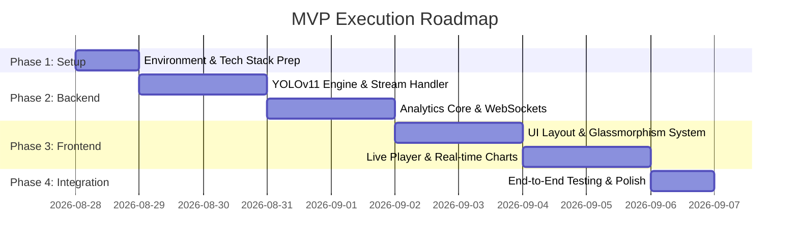

# Task Roadmap & MVP Scope
## Smart City Real-Time Vehicle Detection System

---

## 🎯 MVP Scope & Success Criteria

Tujuan dari tahap **MVP (Minimum Viable Product)** adalah membangun aplikasi *end-to-end* yang berfungsi secara utuh:
- [x] Backend Python yang mampu memuat model **YOLOv11** dan memproses *stream video CCTV / file MP4*.
- [x] Deteksi & *Tracking ID* kendaraan (Mobil, Sepeda Motor, Bus, Truk).
- [x] Perhitungan statistik kendaraan, *Traffic Density Status* (Lancar/Sedang/Macet), dan *ROI Line Crossing*.
- [x] Streaming video frame (MJPEG) & data statistik real-time (WebSocket).
- [x] Dashboard frontend berbasis *Dark Glassmorphism UI* dengan statistik KPI, player CCTV, dan grafik tren real-time.

---

## 📋 Task Breakdown Roadmap

---

### Phase 1: Environment & Project Setup
- [x] **Task 1.1: Backend Structure Setup**
  - Membuat struktur folder backend (`backend/app/`, `backend/models/`, `backend/services/`).
  - Menyiapkan `requirements.txt` (`fastapi`, `uvicorn`, `ultralytics`, `opencv-python`, `websockets`, `pydantic`).
- [x] **Task 1.2: Download Weights & Assets**
  - Mengunduh model YOLOv11 (`yolo11n.pt` / `yolo11s.pt`).
  - Menyediakan sampel video CCTV lalu lintas (`assets/sample_cctv.mp4`) untuk pengujian offline.
- [x] **Task 1.3: Frontend Application Init**
  - Menginisialisasi frontend di folder `frontend/` (Modern HTML5/JS atau React + Vite).
  - Menyiapkan struktur `src/styles/index.css` berdasarkan `StyleGuide.md`.

---

### Phase 2: Backend & YOLOv11 Core Engine
- [x] **Task 2.1: Video Stream Ingestion Handler (`stream_handler.py`)**
  - Membuat kelas pengambil frame video fleksibel (mendukung URL RTSP, URL HLS `.m3u8`, YouTube stream, dan File MP4 lokal).
  - Menambahkan *auto-reconnect* jika stream terputus.
- [x] **Task 2.2: YOLOv11 Detector & ByteTrack Integrator (`detector.py`)**
  - Inisialisasi Ultralytics YOLOv11 dengan filter kelas (Car: 2, Motorcycle: 3, Bus: 5, Truck: 7).
  - Integrasi tracking persistent ID (ByteTrack / BoT-SORT) untuk melacak pergerakan kendaraan.
- [x] **Task 2.3: Traffic Analytics Module (`analytics.py`)**
  - Kalkulasi jumlah kendaraan aktif per frame (Active Vehicle Count per Class).
  - Kalkulasi *Traffic Density Status* (`LANCAR` < 8, `SEDANG` 8-18, `MACET` > 18).
  - Kalkulasi *Virtual Line Crossing Counter* (menghitung garis ROI).
- [x] **Task 2.4: FastAPI Stream & WebSocket Endpoints (`main.py`)**
  - Endpoint MJPEG Stream (`GET /api/stream/video`).
  - Endpoint WebSocket Telemetry (`WS /ws/telemetry`).
  - Endpoint API Kamera Switcher (`GET /api/cameras`, `POST /api/stream/select`).

---

### Phase 3: Frontend Dashboard Development
- [x] **Task 3.1: Glassmorphic Dark UI & Styling System**
  - Membuat `index.css` sesuai `StyleGuide.md` (Design tokens, backdrop blur, bento grid 12 kolom).
  - Menyusun komponen *Header*, *Main Video Container*, *Side Telemetry Panel*, dan *Bottom CCTV Selector*.
- [x] **Task 3.2: Live Video Canvas & Bounding Box Overlay**
  - Komponen player video stream yang lancar dan bebas latency.
  - Opsi *Toggle Overlay* (tampilkan/sembunyikan Bounding Box & Garis ROI).
- [x] **Task 3.3: Real-Time Telemetry KPI Cards**
  - Card Total Kendaraan, Mobil, Motor, Bus, dan Truk dengan animasi angka bertambah.
  - Status Badge Kepadatan (`LANCAR` / `SEDANG` / `MACET`) dengan efek *glowing pulse*.
  - Indikator Backend FPS & Stream Ping.
- [x] **Task 3.4: Real-Time Traffic Density Chart Integration**
  - Integrasi Chart.js / Recharts untuk menampilkan grafik tren jumlah kendaraan per detik/menit.
- [x] **Task 3.5: Camera Switcher & Snapshot Tool**
  - Dropdown & Thumbnail selector untuk berpindah kamera CCTV.
  - Tombol *Take Snapshot* untuk mengunduh gambar hasil deteksi saat ini.

---

### Phase 4: Integration & Verification
- [x] **Task 4.1: WebSocket & Telemetry Integration**
  - Menghubungkan WebSocket frontend dengan backend stream service.
  - Memastikan rekoneksi otomatis jika WebSocket terputus.
- [x] **Task 4.2: End-to-End Testing on Live CCTV Streams**
  - Pengujian dengan video sampel lalu lintas lokal dan stream CCTV publik real.
  - Pengujian kestabilan deteksi pada berbagai tingkat kepadatan lalu lintas.
- [x] **Task 4.3: Performance & Benchmarking**
  - Memastikan penggunaan CPU/GPU stabil.
  - Verifikasi latency < 300ms.

---

### Phase 5: Documentation & Handover
- [x] **Task 5.1: Create Comprehensive `README.md`**
  - Petunjuk instalasi dependencies, cara menjalankan backend FastAPI, dan cara membuka Dashboard frontend.
